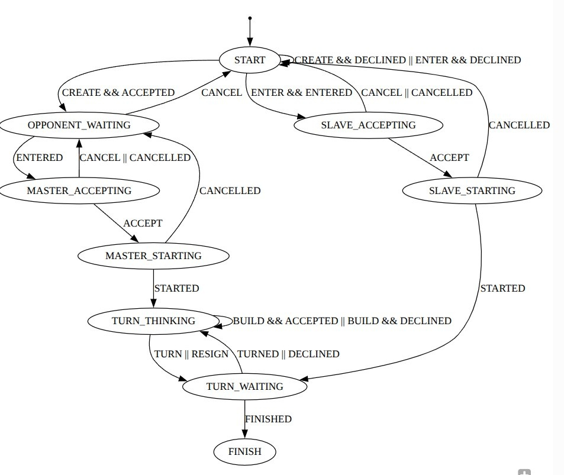

# состав команды

Литвинов Владислав Андреевич Б23-503.
Планкин Павел Борисович Б23-503.

# назначение системы, целевых пользователей и их роли

Онлайн игра 1 на 1 по типу шахмат / го / шашек. Наличие рейтинговой системы, количество побед / поражений, система эло.

#### возможности ролей пользователей

- regular - создать / присоединиться к сессии. скрыть / открыть (в случае если он не был принудительно скрыт admin) свой профиль и свой elo из leaderboard.
- admin - скрыть профиль regular, после чего он перестанет отображаться в leaderboard и у него не будет виден elo. обратно открыть профиль сам regular не сможет.

admin это подмножество regular.

# функциональные требования

- авторизация по oauth2 google. подтягивает никнейм и аватарку.

- создание игровой сессии. появится в списке свободных сессий. на эндпоинте списка свободных сессий должны быть фильтры:

    - по никнейму

    - по elo (если у человека он открыт или не скрыт админом)

- присоединение к игровой сессии. у создающего появится popup с информацией о том, кто присоединяется, и возможностью отклонить / принять.

- leaderboard по elo.

- профиль - никнейм, аватарка, эло, победы / поражения, кнопка скрыть / открыть профиль.

# нефункциональные требования

- браузер - firefox.

- журналирование - список матчей, сыгранных пользователем.

- доступность - мобильный, десктоп.

# состав серверной и клиентской частей, основные способы их взаимодействия или перечень API

#### REST

- POST /oauth

- GET /user ? ( {name} или {elo-max} ) и {pagination}

- GET /user/{id}

    - видны никнейм, аватар, число побед / поражений.

    - если профиль свой, то кнопка скрыть.

    - если чужой и не скрыт, то видны elo.

- GET /user/{id}/match ? {pagination}

- PUT /user/{id} ? {hidden = 0 | 1}

    - если выполняет действие админ над юзером, то hidden будет неснимаемый

- GET /match ? ( {name} или {elo-max} ) и {pagination}

#### web-socket

машина состояний для web-socket игровой сессии. глагол в настоящем времени - запрос клиента, в прошедшем времени - ответ сервера. CREATE / CREATED.

# распределение ролей

- frontend, web-socket client, canvas game, тз - Литвинов

- backend, web-socket server, database - Планкин

# этапы

- авторизация oauth

- профиль, никнейм, аватарка

- админ. скрыть / открыть профиль

- лидерборд

- создание и присоединение к игровой сессии

- игровой цикл, игра на canvas

- логика начисления эло, логирование истории матчей, числа побед / поражений
